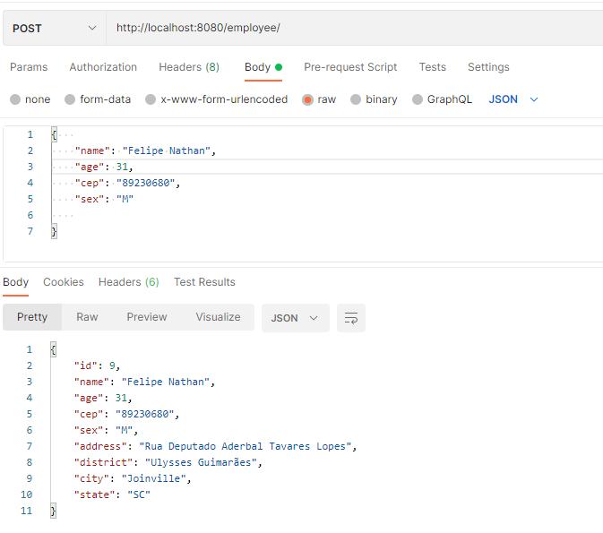
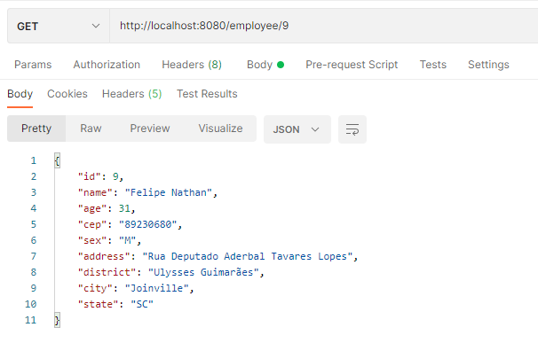
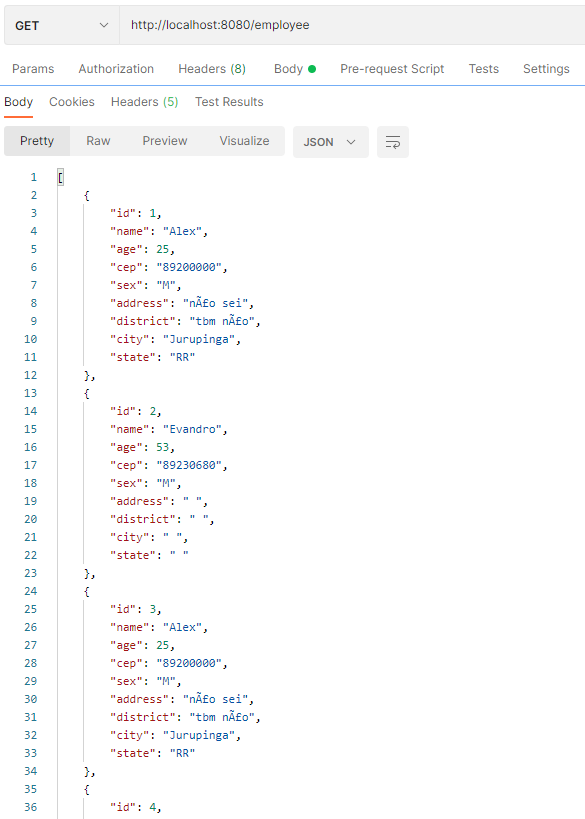
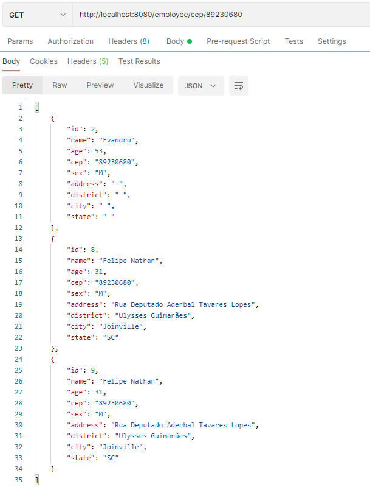
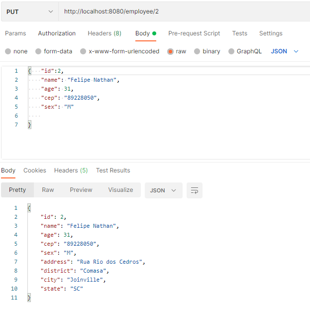
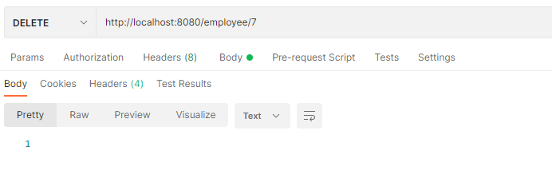

## Requisitos
- java 11+
 - springboot
 - junit5
 - h2 database

## Objetivo
- Sistema usado para gerenciar os funcionários de uma empresa pequena.

## Uso

Para rodar o projeto execute:
```./mvnw spring-boot:run```


- O servidor irá iniciar em localhost na porta 8080 por padrão

- POST - Cadastrar um usuário
 


- GET - Buscar um usuário específico pelo id dele



- GET - Buscar todos os usuários cadastrados
 


- GET - Buscar usuários por CEP
 


- PUT - Atualizar a entidade funcionário
 


- DELETE - Excluir funcionário
 


